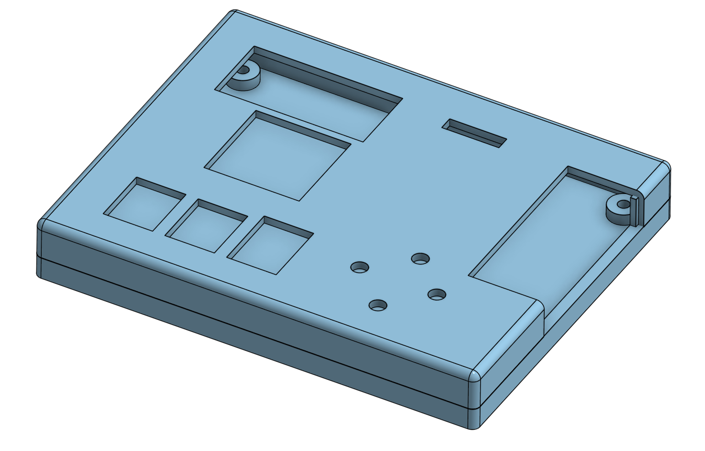
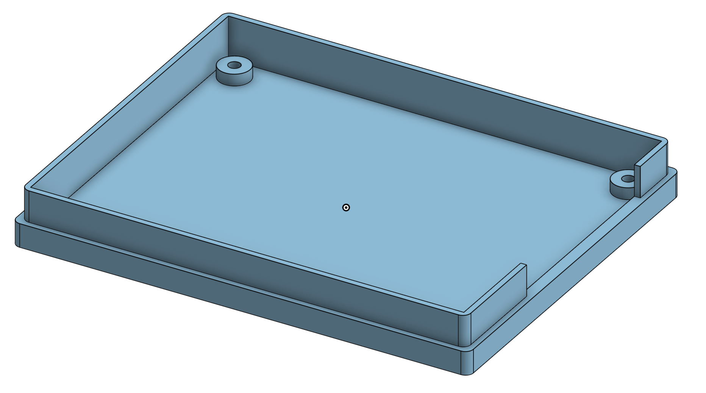

# Case Design Reference

Apart from the electrical hardware, I also created a 3-D printed case for the PCB. This was to minimize the chance of accidental shorts when setting the device down.

The design files for this can be found in the `NEMO/Case_Design/*`

## Files

### **Bottom.stl**

The bottom part of the case

### **Top.stl**

The top part of the case

## Printing

I printed both the top and bottom on my P1S and they turned out great with PLA+.