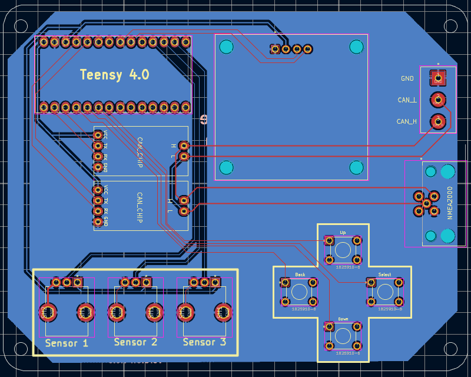
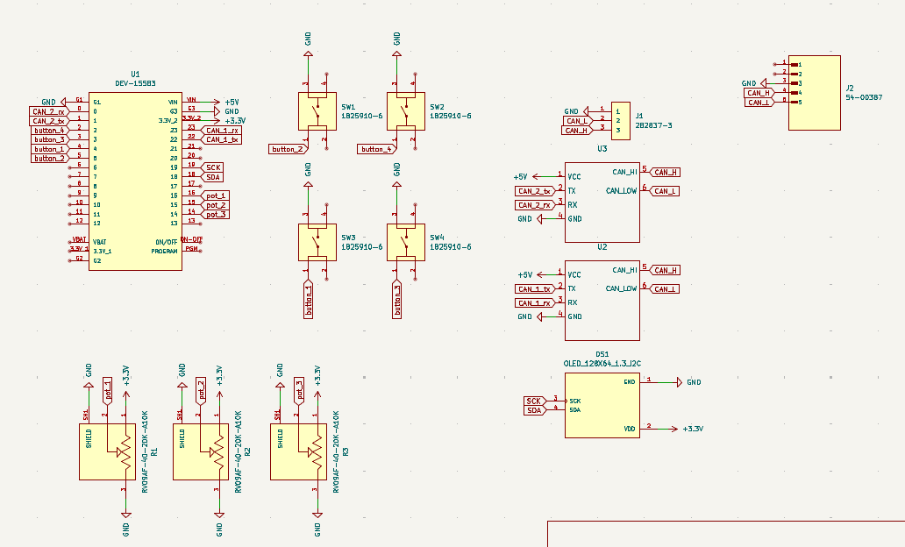

# PCB Design Reference

So you want to build your own NEMO? Cool. This doc covers everything about the PCB including what's on it, why it's there, and how to not screw up the assembly.

If you don't want to go through the hassle of getting the PCB ordered or you don't want to use a Breadboard to build out the schematic you're in luck!

Email me at nemo@jamescampbell.org with "Board Request" as the subject and I will work with you to get a board shipped out.

## What We're Building

The NEMO PCB is a Teensy 4.0 shield that adds:
- Dual CAN bus interfaces (one for talking, one for snooping)
- OLED display for the UI
- D-pad buttons for navigation
- Three pots for controlling values
- NMEA2000 connector to plug into real networks

All the design files are KiCad 9.0 format in the `PCB/` folder.

## PCB Design

## Schematic

If you don't want to build the PCB from scratch, you can just use the schematic to build your own version.

## Parts List

### Links to Amazon

Below are the links to the parts I used when building my prototypes and ultimately my final board. There are definetly cheaper options, but milage may vary

| | |
|-|-|
|Teensy 4.0|https://www.sparkfun.com/teensy-4-0.html|
|SH1106 Display|https://www.amazon.com/dp/B0C3L7N917|
|TJA1050|https://www.amazon.com/dp/B0C7ZBDG4B|
|10k Potentiometer| https://www.amazon.com/dp/B0DN1DHWLR|
|Buttons|https://www.amazon.com/dp/B07HB12V9Q|
|3 Screw Terminal|https://www.amazon.com/dp/B08PQG24YK|
|NMEA2000 Terminal|https://us.rs-online.com/product/rs-pro/2017209/72310500/|

**I do not guarentee quality from a supplier. These are just what worked for me.**

### The Brain: Teensy 4.0

| | |
|-|-|
| Part | SparkFun DEV-15583 |
| Chip | NXP iMXRT1062, ARM Cortex-M7 @ 600MHz |
| CAN | 2x FlexCAN controllers (this is why I picked it) |

**Pin Usage**:

| Pin | What | Why |
|-----|------|-----|
| 0 | CAN2_TX | Monitor bus TX (not really used in listen-only) |
| 1 | CAN2_RX | Monitor bus RX |
| 2 | button_1 | Left/Back |
| 3 | button_2 | Down |
| 4 | button_4 | Right/Select |
| 5 | button_3 | Up |
| 14 (A0) | pot_3 | Sensor 3 value |
| 15 (A1) | pot_2 | Sensor 2 value |
| 16 (A2) | pot_1 | Sensor 1 value |
| 18 | SDA | I2C data to display |
| 19 | SCL | I2C clock to display |
| 22 | CAN1_TX | Attack/transmit bus TX |
| 23 | CAN1_RX | Attack/transmit bus RX |

### CAN Transceivers

You need two of these - one for each CAN bus.

| | |
|-|-|
| Options | TJA1050 |
| Voltage | **5V** - this is important! |

**Wiring**:

| Pin | Function |
|-----|----------|
| 1 | TXD (from Teensy) |
| 2 | GND |
| 3 | VCC (5V) |
| 4 | RXD (to Teensy) |
| 5 | CANL |
| 6 | CANH |

U2 = CAN1 (the attack bus)
U3 = CAN2 (the sniffer bus)

### Display

Just a 4-pin header: GND, VCC, SCL, SDA. Most modules have pull-ups built in.

Watch out! Some cheap displays have different pinouts. I made a mistake on the first prototype and burnt out a teensy. **Be Careful**

### Buttons

These are the D-pad:
- SW1 = Up (Pin 5)
- SW2 = Down (Pin 3)
- SW3 = Left (Pin 2)
- SW4 = Right (Pin 4)

Active low - one pin to GPIO, one pin to ground. Firmware enables internal pullups.

### Pots (R1-R3)

Wiring:
- Pin 1 (CCW end): GND
- Pin 2 (wiper): Teensy analog input
- Pin 3 (CW end): 3.3V

These control the sensor values and attack parameters. Turn the knob, change the data.

### NMEA2000 Connector

| | |
|-|-|
| Part | RS PRO 2017209 |
| Mates with | Standard NMEA2000 cables |

**Pinout** (standard NMEA2000):

| Pin | Color | Function |
|-----|-------|----------|
| 1 | White | Shield/GND |
| 2 | Blue | CAN_L |
| 3 | Black | GND |
| 4 | Red | +12V (optional power input) |
| 5 | White | CAN_H |

This connects to CAN2 (the sniffer). You can plug NEMO right into a boat's backbone.

### Terminal Block 

Alternative CAN connection for bench testing. CAN_H, CAN_L, GND.

## Power

### Where It Comes From

**USB** 
- Plug USB into the Teensy
- Teensy's regulator provides voltage to everything
- Simple, good for development

Okay, I get it. Powering the device via the NMEA2000 bus would be cool. There is probably a version 2 coming down the line with that capability. However, I wanted to make this project as beginner friendly as possible and built with only readily accessible consumer parts. As a result, it was a conscience decision not to connect power to the bus. I don't need someone blowing out their USB port because they left it plugged in while they also had it connected to the NMEA2000 network.

**CAN1**: This is where NEMO transmits messages. Fake sensors broadcast here, attacks go here.

**CAN2**: Listen-only mode. NEMO watches the network without participating in arbitration.

## Resources

- [Teensy 4.0 Pinout](https://www.pjrc.com/teensy/pinout.html)
- [NMEA2000 Physical Layer](https://www.nmea.org/)
- [KiCad Docs](https://docs.kicad.org/)

That's the hardware. Build it, flash it, plug it into a boat network, and have fun.
